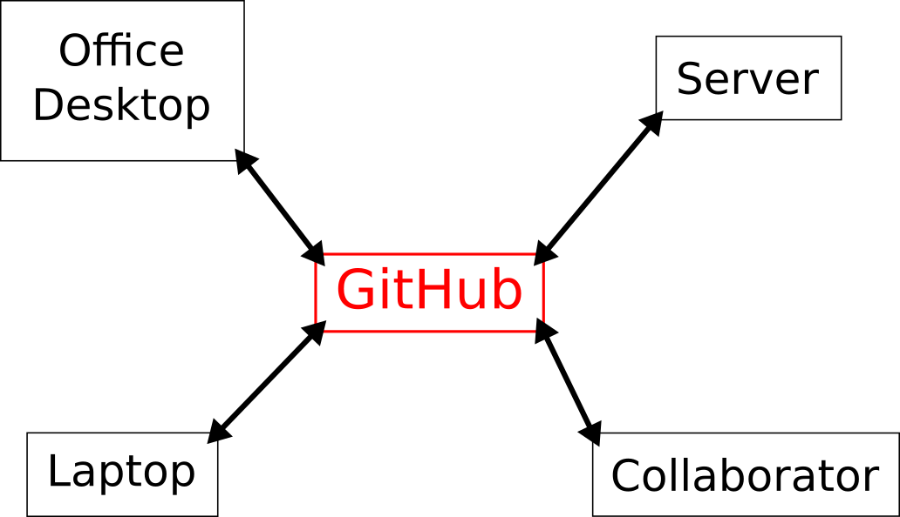

```{r setup, echo=FALSE}
```

## Notes

This lecture was modeled from several tutorials available online and in some cases, took material & quotes directly:

[R packages book section by Hadley Wickham](http://r-pkgs.had.co.nz/git.html)

[Happy Git and Github for the useR by Jenny Bryan](http://happygitwithr.com/)

[git/github guide by Karl Broman](http://kbroman.org/github_tutorial/)

[Version Control with Git from Software Carpentry](http://swcarpentry.github.io/git-novice/)

[Git for Humans by Alice Bartlett](https://speakerdeck.com/alicebartlett/git-for-humans)

Additional Git resources are listed in Karl's guide: [Resources](http://kbroman.org/github_tutorial/pages/resources.html)

## What is Git?

1. Git is an application in the same way a web browser or text editor is an application.
1. Git is a version control system (It is not the only one available). 
1. Version control systems are like "track changes" in word. 
    - keep track of changes to projects
    - take a snapshot of a project at different stages


## Why Git?

1. Version control is the only reasonable way to keep track of changes in code, manuscripts, presentations, and data analysis projects.
    - There are other systems (e.g., numbering files)
      - less consistent in use and implementation 
      - result in file bloat
        - MS_v1, MS_v2, MS_v85, MS_final, MS_final_FINAL, MS_Jan2, MS_v2a.....
1. Git can be an "electronic lab book": a record of every small change

## Why GitHub?

1. Hosts tons of repositories for projects and software in the life sciences and beyond
1. History of all of these projects is visible in a totally open way
1. Easy, seamless collaboration. 
1. Links to NIH figshare and Zenodo, etc.
1. Free private repositories & Free "Pro" account for educational use
<center>

</center>


<div class="notes">

You can suggest changes to others, they can suggest things to you. You can collaborate with yourself (home computer, work computer, server). 

</div>

## Assignment 

See [github instructions](https://help.github.com/articles/set-up-git/) and do the following:

1. Get a github account (use your MU email)
1. Request an educational discount for FREE private repositories
1. Download and install git
1. Set up git with your user name and email
1. Set up ssh or a password

Do this before our git workshop!

## Yes, it will hurt to use. It is worth it.

1. Short-term cost but long-term benefit
    - Be kind to your future self!
1. Requires a time investment and practice 
1. The "hard" way is really the easy way in the long run

<center>

</center>

<div class="notes">

Like many aspects of reproducible research, git is something that has a short term cost and a long term benefit. Benificiaries include your collaborators, your future self, other scientists, and ultimately the general public. 
1. It will take time to learn to use git, to make it part of your routine workflow, and to feel skilled & comfortable with it. Practice is the answer to this.
1. The major benefits are that it makes keeping track of the history of a project possible, and it makes collaborating on a project proceed much more smoothly.

when have you read the methods for some analysis you wanted to do and said, what? 
 
</div>

## General Use and Terms

1. **repository** - a set of files for a given project that you will track
1. **commit** - a snapshot of the repository made at a certain time with a message
1. **clone** - making a copy of a repository to another machine
1. **remote** - a place to store the master copy of the repository on the internet (e.g. GitHub) 
1. **branch** - an independent copy of the repository. Often you will try out changes on a developer branch before moving them to the master copy
1. **push** - moving commits to the remote copy
1. **pull** - getting commits from the remote copy
1. **merge** -moving changes from one branch to the master copy

## Use cases

Let's look at some repositories on github to see some examples.

<div class="notes">
[Karl's fruit snacks](https://github.com/kbroman/FruitSnacks)
    - images 
    - commit msg
    - Readme
[our class](https://github.com/kmiddleton/quant_methods)
    - contributions
    - releases

[Enoch's h2 paper](https://github.com/EGKingLab/h2lifespan)
    - readme

[Beavis effect](https://github.com/egking/QTLbiasSIM)
    - early attempt
    - single commit
    - bad readme
    - no git
[Kevin's lab](https://github.com/Middleton-Lab)

</div>

## Let's Practice: Ways to use Git

There are a few ways to use Git. We will show you all three today.   

- via a desktop GitHub client
    - [GitHub Desktop](https://desktop.github.com/)
    - [GitKraken](https://www.gitkraken.com/)
- via Rstudio (using [RStudio projects](https://support.rstudio.com/hc/en-us/articles/200526207-Using-Projects))
- via the command line 

> Practice these this week before the workshop

## Starting a project (repository)

The first thing we need to do is create a new repository. There are a couple different ways to set up a repository. 

1. Creating a repository on GitHub (this is the preferred method)
    - You can still use this even if you have files already
1. Creating a repository on your local machine (see other tutorials for this method)
    - Beginning with an empty project folder
    - Beginning with a project folder with stuff in it

> How do you decide what defines a repository?
    
## Creating a repository remotely on GitHub

**Activity**

1. Log in to GitHub.com 
1. Click the "New Repository" button (under the `+` icon in the menu bar)
1. Name your repository with your initials and misc (for example EGKmisc) to hold your miscellaneous R functions
1. Clone the repository to your local machine

## Benefits of starting a repository on GitHub

- Local copy automatically set to properly interact with GitHub
    - Push and pull without additional setup
- Move local files into empty repository
    - Commit in batch or individually
    - Push files to GitHub

## Make a change

**Activity**

1. Start a new R script
1. Write a function or a bit of code
1. Save your file with an informative name in your project folder

## Commits

When you are happy with some work you've done and want to take a snapshot, you will do what is called a commit.

**Activity**

1. Stage your files
1. Commit them with a message like "add function to calculate mean"

Write informative commit messages. Your future self will appreciate it. 

## Syncing: Push and Pull

What we've done so far is take a snapshot locally on our machine. To interact with the remote, we need push and pull.

- Push = moving local changes to the remote
- Pull = moving from remote to local

**Activity**

1. Push your last commit to GitHub
1. Go to github.com and see that your commit is there.

## RStudio Projects

- Git is seemlessly integrated into Rstudio
- Let's go through our basic steps within Rstudio

**Activity**

1. Create an R project within your repository
    - Choose "Existing Directory"
1. Make a new R script
1. Write some code
1. Stage, commit, and push

## Git with the command line

Sometimes you need (and some people prefer) to use the command line to use git

Let's go through the same steps with the command line:

```
git clone https://github.com/egking/comp_bio_MU
git status
git add 
git commit -m "My Message"
git push
```

## Ignoring files with `.gitignore`

- git will track all the files in your repository unless you tell it otherwise
- Common files you may not want to track include very large data files and files like the R history file
    - .DS_Store
    - .Rhistory
    - .RData
    - *.Rda
    - Anything with sensitive information

## Plan for the workshop

1. Q & A from this lecture
1. Review setting up a personal repository, committing changes, pushing & pulling
1. Setting up a collaborative repository with a small group

Our goal at the end of the day is for you to feel comfortable using git and committed to use git for the projects you are working on now and in the future.


